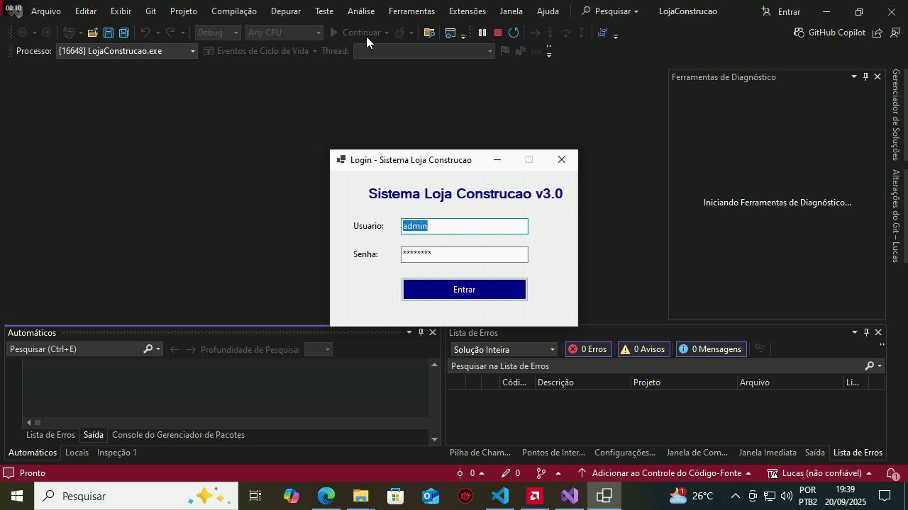
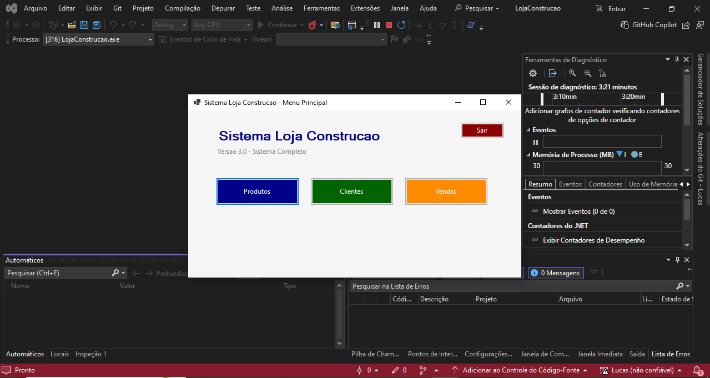
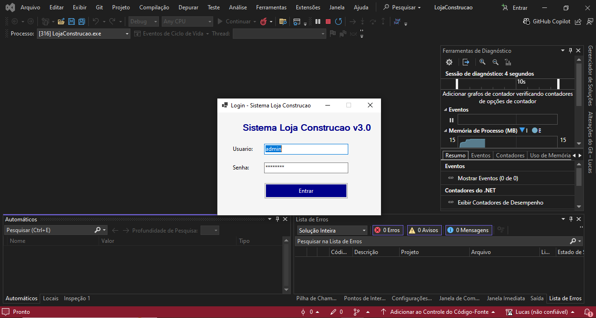
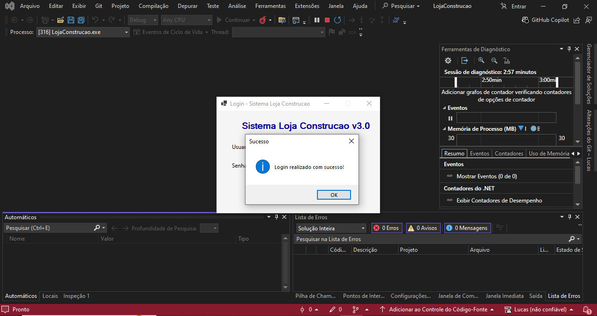
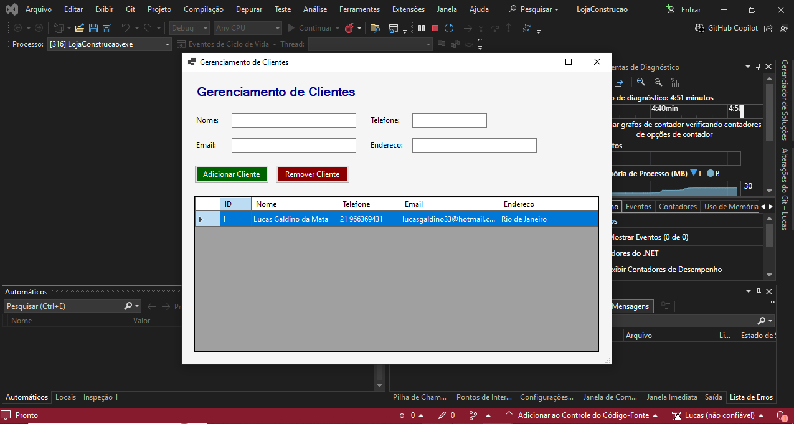
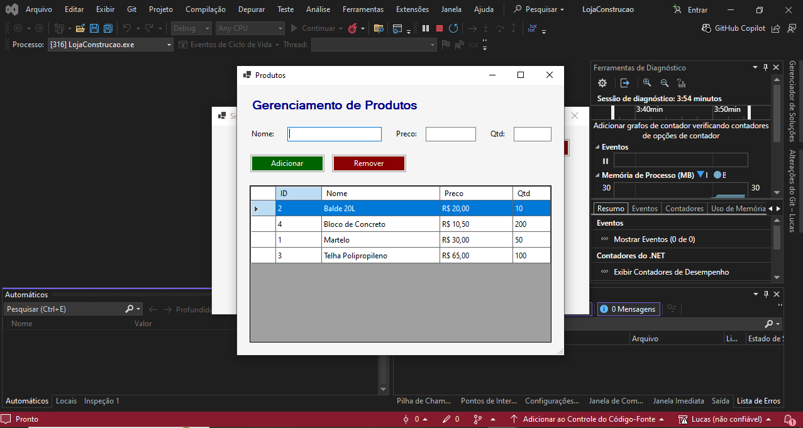
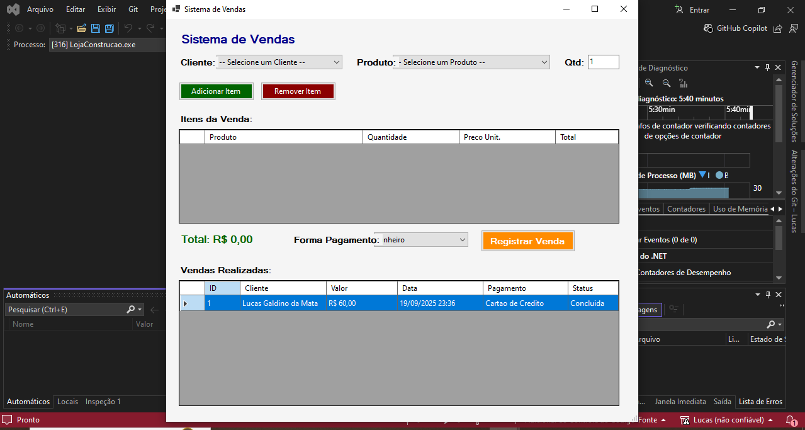

# 🏗️ Sistema de Gerenciamento - Loja de Construção  

[](https://www.linkedin.com/in/lucas-galdino-da-mata-6834621a4/) 
[](https://github.com/LucasMata33)

---

## 🚀 Sobre o Projeto
Desenvolvi um Sistema **desktop basico** para gerenciamento de loja de materiais de construção, desenvolvido em **C# 12** com **.NET 8.0**, **Windows Forms** e banco **SQLite**.  

💡 Este projeto destaca minhas habilidades em:
- Desenvolvimento desktop com C#/.NET
- Arquitetura em camadas (MVC + Repository Pattern)
- Segurança (hash de senhas com SHA256 + Salt)
- Boas práticas de logging e auditoria
- Banco de dados relacional com SQLite

---

## 🖥️ Demonstração Visual
*(imagens ou GIF mostrando o fluxo de login → menu → cadastro de clientes/produtos → vendas)*  


  
  
  
  
  
  
  

---

## 🛠️ Tecnologias Utilizadas
- **Framework**: .NET 8.0  
- **Interface**: Windows Forms  
- **Banco de Dados**: SQLite  
- **Linguagem**: C# 12  
- **Arquitetura**: Repository Pattern, MVC  
- **Segurança**: SHA256 + Salt para senhas  

---

## ⚡ Funcionalidades
- 🔐 **Autenticação Segura**: login com senhas criptografadas  
- 📦 **Gerenciamento de Produtos**: CRUD completo com validações  
- 👥 **Gestão de Clientes**: cadastro e consultas rápidas  
- 💰 **Sistema de Vendas**: registro com cálculo automático  
- 📝 **Auditoria**: logs detalhados de operações e acessos  
- ✅ **Validações robustas**: dados consistentes em todas as telas  

---

## 📂 Estrutura do Projeto

LojaConstrucao/
├── Program.cs # Ponto de entrada
├── LoginForm.cs # Tela de autenticação
├── MainForm.cs # Dashboard principal
├── Utils/
│ ├── Logger.cs # Sistema de logging
│ ├── SecurityHelper.cs # Funções de segurança
│ └── ValidationHelper.cs # Validações centralizadas
├── Models/
│ ├── Produto.cs
│ ├── Cliente.cs
│ └── Venda.cs
├── Data/
│ └── DatabaseHelper.cs # Acesso ao banco
├── Forms/
│ └── ProdutoForm.cs # Formulário de produtos
└── logs/ # Diretório de logs (auto-gerado)


---

---

## ▶️ Como Executar

### Método 1 - Visual Studio
```bash
git clone https://github.com/seu-usuario/sistema-loja-construcao.git
cd sistema-loja-construcao
Abra no Visual Studio 2022

Restaure os pacotes NuGet

Pressione F5 para rodar
```

## Método 2 - Linha de Comando
bash
Copiar código
dotnet restore
dotnet build
dotnet run
---

## Método 3 - Script Automatizado
Execute o arquivo executar.bat

🔑 Credenciais de Teste
Usuário: admin

Senha: admin123

Criados automaticamente na primeira execução.
---

📊 Logs
pgsql
Copiar código
logs/
├── error.log       # Erros e informações gerais
└── security.log    # Tentativas de login e eventos de segurança
📌 Versionamento
v1.0 → Funcionalidades básicas

v2.0 → Melhorias de segurança e validações

v2.1 → Correções de compilação e atualização para .NET 8.0

📜 Licença
Projeto sob a licença MIT. Veja o arquivo LICENSE para mais detalhes.

📬 Contato
👤 Lucas Galdino da Mata
📧 seu-email@exemplo.com
🔗 LinkedIn | GitHub
